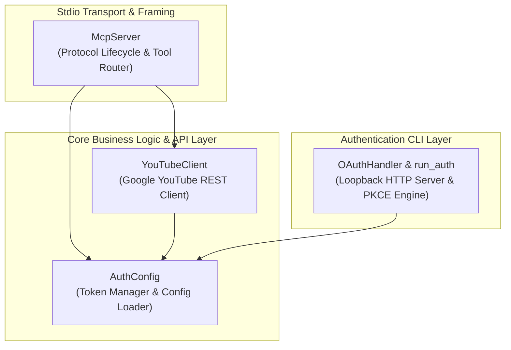

# Components Design

## Component Overview



### Text Alternative
```
[McpServer]
   ├── [AuthConfig] (loads secrets, verifies expiry, updates tokens)
   └── [YouTubeClient] (executes HTTP REST calls to Google APIs)

[OAuthHandler & run_auth]
   └── [AuthConfig] (stores tokens upon successful OAuth callback)
```

---

## Component Specifications

### 1. `McpServer`
- **Module**: `scripts/server.py`
- **Purpose**: Implements the Model Context Protocol (MCP) server over standard input/output (`stdio`).
- **Key Responsibilities**:
  - Encodes and decodes JSON-RPC 2.0 messages with `Content-Length` binary headers.
  - Implements protocol handshakes: `initialize`, `ping`, `tools/list`, and `tools/call`.
  - Dispatches incoming tool execution commands to `YouTubeClient` and `AuthConfig`.
  - Formats results as standardized text content blocks or JSON-RPC error codes.

### 2. `YouTubeClient`
- **Module**: `scripts/server.py`
- **Purpose**: Direct HTTPS REST interface to YouTube Data API v3, YouTube Upload API v3, and YouTube Analytics API v2.
- **Key Responsibilities**:
  - Authenticates outbound HTTP requests with OAuth 2.0 Bearer tokens.
  - Automatically triggers access token refreshes when approaching expiration.
  - Implements 8 core YouTube domain operations (Channels, Videos, Playlists, Thumbnails, Comments, Analytics).

### 3. `AuthConfig`
- **Module**: `scripts/server.py`
- **Purpose**: Local credential resolver, token state store, and refresh coordinator.
- **Key Responsibilities**:
  - Resolves file paths for `client_secret.json` and `token.json` via environment variables (`YOUTUBE_CLIENT_SECRETS`, `YOUTUBE_TOKEN_FILE`) or relative defaults.
  - Monitors token expiration windows (`created_at + expires_in - 120s`).
  - Executes POST request to Google OAuth token endpoint to obtain renewed access tokens.

### 4. `OAuthHandler` & `run_auth`
- **Module**: `scripts/auth.py`
- **Purpose**: One-time interactive OAuth 2.0 PKCE setup utility.
- **Key Responsibilities**:
  - Generates cryptographically secure `state`, `code_verifier`, and SHA-256 `code_challenge`.
  - Spawns background `HTTPServer` on `127.0.0.1:8765`.
  - Catches browser callback with `code`, performs authorization code grant exchange, and writes `secrets/token.json`.
