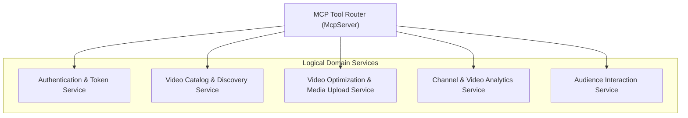

# Services & Orchestration Layer

## Overview
While the runtime is implemented as a lightweight micro-server, the business capabilities logically partition into 5 distinct domain services:



### Text Alternative
```
[MCP Tool Router]
   ├── [Authentication & Token Service]
   ├── [Video Catalog & Discovery Service]
   ├── [Video Optimization & Media Upload Service]
   ├── [Channel & Video Analytics Service]
   └── [Audience Interaction Service]
```

---

## Service Specifications

### 1. Authentication & Token Service
- **Orchestration**:
  1. `youtube_auth_status` / `youtube_start_auth` queries `AuthConfig`.
  2. For API calls, `YouTubeClient._access_token()` intercepts the request:
     - Calculates: `time_to_expiry = (created_at + expires_in) - now()`.
     - If `time_to_expiry <= 120s`, invokes `POST https://oauth2.googleapis.com/token` with `grant_type=refresh_token`.
     - Atomically updates `secrets/token.json` before returning the fresh Bearer token.

### 2. Video Catalog & Discovery Service
- **Orchestration**:
  1. Calls `youtube_channel_overview` to resolve the authenticated channel's `uploads` playlist ID (`UU...`).
  2. Queries `GET /playlistItems` with pagination parameters.
  3. Extracts array of `videoId` strings and performs a batched lookup via `GET /videos?id=id1,id2,...` to enrich items with view counts, like counts, and privacy status.
  4. Merges and returns structured video items.

### 3. Video Optimization & Media Upload Service
- **Orchestration**:
  - **Metadata Update**: Performs read-modify-write pattern: reads current snippet & status via `get_video`, overwrites specified fields, and submits `PUT /videos`.
  - **Thumbnail Upload**: Resolves local file system path, inspects binary header / extension for MIME type, streams raw bytes to `https://www.googleapis.com/upload/youtube/v3/thumbnails/set`.

### 4. Channel & Video Analytics Service
- **Orchestration**:
  - Validates date formats (`YYYY-MM-DD`).
  - Dispatches authorized queries to `https://youtubeanalytics.googleapis.com/v2/reports`.
  - Filters by `channel==MINE` or `video=={video_id}`.

### 5. Audience Interaction Service
- **Orchestration**:
  - List comment threads: queries `GET /commentThreads` with `order=relevance` and `textFormat=plainText`.
  - Post comment: constructs `commentThread` payload with `topLevelComment` snippet and submits `POST /commentThreads`.
