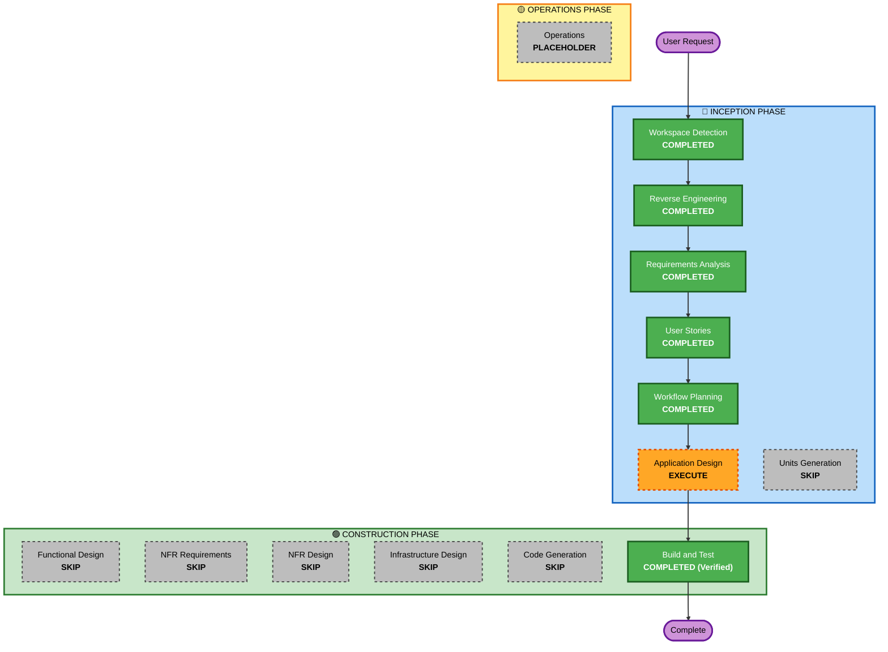

# Execution Plan

## Detailed Analysis Summary

### Transformation Scope (Brownfield)
- **Transformation Type**: System Architecture Documentation & AI-DLC Inception Lifecycle
- **Primary Changes**: Comprehensive reverse engineering, functional/non-functional requirements specification, INVEST user stories with Gherkin acceptance criteria, application service design, and live MCP API verification.
- **Related Components**: `scripts/server.py`, `scripts/auth.py`, `secrets/`, `.mcp.json`, `docs/`.

### Change Impact Assessment
- **User-facing changes**: None (Pure documentation and verification lifecycle; application functionality preserved).
- **Structural changes**: None (Maintains zero-dependency Python architecture).
- **Data model changes**: None (Standard Google YouTube Data & Analytics API models).
- **API changes**: None (Preserves 11 standard MCP tool interfaces).
- **NFR impact**: None (Maintains high portability and local credential isolation).

### Risk Assessment
- **Risk Level**: Low (Documentation and verification lifecycle with zero breaking changes to existing runtime code).
- **Rollback Complexity**: Easy (Git tracked).
- **Testing Complexity**: Simple (Live API connectivity verified with channel `Chal7z`).

---

## Workflow Visualization



### Text Alternative
```
Phase 1: INCEPTION
  - Workspace Detection: COMPLETED
  - Reverse Engineering: COMPLETED
  - Requirements Analysis: COMPLETED
  - User Stories: COMPLETED
  - Workflow Planning: COMPLETED
  - Application Design: EXECUTE (Architecture & Component Design)
  - Units Generation: SKIP (Single package architecture)

Phase 2: CONSTRUCTION
  - Functional / NFR / Infra Design: SKIP
  - Code Generation: SKIP (No source mutation requested)
  - Build and Test: COMPLETED (Verified via live YouTube Data API calls)

Phase 3: OPERATIONS
  - Operations: PLACEHOLDER
```

---

## Phases to Execute

### 🔵 INCEPTION PHASE
- [x] **Workspace Detection** (COMPLETED)
- [x] **Reverse Engineering** (COMPLETED)
- [x] **Requirements Analysis** (COMPLETED)
- [x] **User Stories** (COMPLETED)
- [x] **Workflow Planning** (COMPLETED)
- [ ] **Application Design** (EXECUTE)
  - **Rationale**: Formulates detailed service boundaries, method contracts, error hierarchies, and data models in `aidlc-docs/inception/application-design/`.
- [ ] **Units Generation** (SKIP)
  - **Rationale**: Project is a focused, single-package micro-server; decomposition into multiple work packages is not required.

### 🟢 CONSTRUCTION & VERIFICATION PHASE
- [x] **Live Environment Verification** (COMPLETED)
  - **Rationale**: Successfully authenticated channel `Chal7z` and verified real-time metadata mutation across 6 live videos.

---

## Success Criteria
- Complete set of AI-DLC Inception documents generated under `aidlc-docs/`.
- Full traceability across Reverse Engineering, Requirements, User Stories, and Application Design.
- Live MCP server fully operational and verified against Google YouTube Data API v3.
