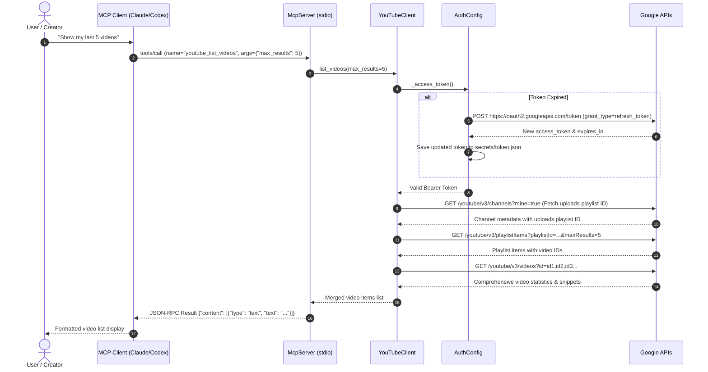

# System Architecture

## System Overview
YouTube Studio MCP is an open, lightweight, and runtime-dependency-free Model Context Protocol (MCP) server built with Python 3.10+. It connects LLM-based desktop agents (Codex, Claude Desktop, Cursor) to Google's YouTube Data API v3 and YouTube Analytics API v2 through local standard input/output (stdio) communication.

All network interactions with Google APIs use standard HTTP REST calls over HTTPS via Python's built-in `urllib` package, removing any external dependencies on third-party SDKs or package managers.

---

## Architecture Diagram

```mermaid
flowchart TD
    subgraph Host["Local Environment / Desktop Host"]
        subgraph Agent["MCP Client Agent"]
            Codex["Codex / Claude Desktop / Cursor"]
        end

        subgraph Server["YouTube Studio MCP Server (Python Runtime)"]
            StdioHandler["Stdio Message Framer & Router<br/>(Content-Length / JSON-RPC 2.0)"]
            McpRouter["McpServer Class<br/>(tools/list, tools/call)"]
            YTClient["YouTubeClient Class<br/>(API Request Builder & Dispatcher)"]
            AuthEngine["AuthConfig & Token Lifecycle<br/>(Auto Token Refresh)"]
        end

        subgraph LocalStore["Local Storage"]
            ClientSecret["secrets/client_secret.json"]
            TokenFile["secrets/token.json"]
        end

        subgraph AuthCLI["CLI Authentication Tool"]
            AuthScript["scripts/auth.py"]
            LocalHTTPServer["Loopback HTTP Server (:8765)<br/>(OAuth Callback Listener)"]
        end
    end

    subgraph GoogleCloud["Google Cloud Platform APIs"]
        OAuthService["Google OAuth 2.0 Auth & Token Service"]
        YTData["YouTube Data API v3<br/>/channels, /videos, /playlistItems,<br/>/commentThreads, /thumbnails/set"]
        YTAnalytics["YouTube Analytics API v2<br/>/reports"]
    end

    Codex <-->|JSON-RPC 2.0 via Stdio| StdioHandler
    StdioHandler <--> McpRouter
    McpRouter --> YTClient
    YTClient <--> AuthEngine
    AuthEngine <--> LocalStore
    AuthEngine <-->|POST /token (Refresh)| OAuthService

    AuthScript <--> LocalStore
    AuthScript --> LocalHTTPServer
    AuthScript <-->|PKCE Auth Code Exchange| OAuthService

    YTClient <-->|HTTPS REST| YTData
    YTClient <-->|HTTPS REST| YTAnalytics
```

### Text Alternative
```
[MCP Client (Codex/Claude)]
      | (stdio JSON-RPC 2.0)
      v
[Stdio Message Framer] <---> [McpServer Router]
                                    |
                            [YouTubeClient] <---> [AuthConfig / Token Manager]
                                    |                      |
            +-----------------------+                      v
            |                        |              [Local Storage: secrets/*.json]
            v                        v                     |
[YouTube Data API v3]    [YouTube Analytics API v2]        v
                                                    [Google OAuth 2.0 Endpoint]
```

---

## Component Descriptions

### 1. `McpServer` (`scripts/server.py`)
- **Purpose**: Central MCP protocol coordinator.
- **Responsibilities**:
  - Parses incoming JSON-RPC 2.0 messages from standard input (`sys.stdin.buffer`).
  - Serializes responses and error payloads to standard output (`sys.stdout.buffer`) adhering to `Content-Length: <n>\r\n\r\n` framing.
  - Implements protocol lifecycle methods: `initialize`, `ping`, `tools/list`, and `tools/call`.
  - Dispatches tool invocations to `YouTubeClient` and `AuthConfig`.
- **Type**: Application / Server

### 2. `YouTubeClient` (`scripts/server.py`)
- **Purpose**: Direct REST client communicating with Google YouTube APIs.
- **Responsibilities**:
  - Formulates HTTP requests with bearer authorization headers.
  - Automatically verifies and refreshes OAuth access tokens before outbound dispatch.
  - Implements endpoint wrappers:
    - `channel_overview`: Fetches authenticated channel profile and related uploads playlist.
    - `list_videos`: Queries upload playlist items and batches video detail retrieval.
    - `get_video` & `update_video`: Reads and mutates video snippets/status.
    - `upload_thumbnail`: Streams multipart/media image upload to `/thumbnails/set`.
    - `channel_analytics` & `video_analytics`: Queries YouTube Analytics reports.
    - `post_comment` & `list_comments`: Manages top-level video comments.
- **Type**: Client / API Layer

### 3. `AuthConfig` (`scripts/server.py`)
- **Purpose**: Credential state resolver and token freshness controller.
- **Responsibilities**:
  - Resolves file system paths for `client_secret.json` and `token.json` via environment variables or default relative paths.
  - Checks configuration health and reports authentication readiness.
  - Manages token expiration checking (`expires_in` buffer window of 120 seconds) and triggers refresh flow against `https://oauth2.googleapis.com/token`.
- **Type**: Core / Security

### 4. `OAuthHandler` & `run_auth` (`scripts/auth.py`)
- **Purpose**: Interactive setup and PKCE authentication assistant.
- **Responsibilities**:
  - Computes `code_verifier` (48-byte URL-safe string) and SHA-256 `code_challenge`.
  - Spins up a background `HTTPServer` on `127.0.0.1:8765`.
  - Opens the user's browser with the Google OAuth authorization URL.
  - Catches the redirect with authorization code and exchanges it for persistent tokens.
- **Type**: CLI Tool / Auth Setup

---

## Data Flow



### Text Alternative
```
1. User asks client: "Show my last 5 videos"
2. MCP Client sends tools/call (youtube_list_videos) over stdio
3. McpServer invokes YouTubeClient.list_videos()
4. YouTubeClient checks token freshness via AuthConfig; refreshes if expired
5. YouTubeClient queries YouTube Data API for channel uploads playlist
6. YouTubeClient queries YouTube Data API for playlist items
7. YouTubeClient queries YouTube Data API for video details and statistics
8. YouTubeClient merges responses and returns to McpServer
9. McpServer wraps result in JSON-RPC format and writes to stdio
10. MCP Client renders response for User
```

---

## Integration Points

- **Google OAuth 2.0 Auth Server**: `https://accounts.google.com/o/oauth2/v2/auth` (User authorization)
- **Google OAuth 2.0 Token Server**: `https://oauth2.googleapis.com/token` (Code exchange & token refresh)
- **YouTube Data API v3**: `https://www.googleapis.com/youtube/v3` (Channels, PlaylistItems, Videos, CommentThreads)
- **YouTube Upload API v3**: `https://www.googleapis.com/upload/youtube/v3` (Thumbnail media uploads)
- **YouTube Analytics API v2**: `https://youtubeanalytics.googleapis.com/v2` (Reports)
- **Local File System**: `secrets/client_secret.json`, `secrets/token.json`

---

## Infrastructure Components
- **Hosting Model**: Pure local execution on the creator's machine.
- **Runtime**: Python standard library (CPython 3.10+).
- **Communication Channel**: Standard input/output pipes (stdio).
- **Network Ports**: Ephemeral port `8765` bound to `127.0.0.1` during interactive OAuth login only.
