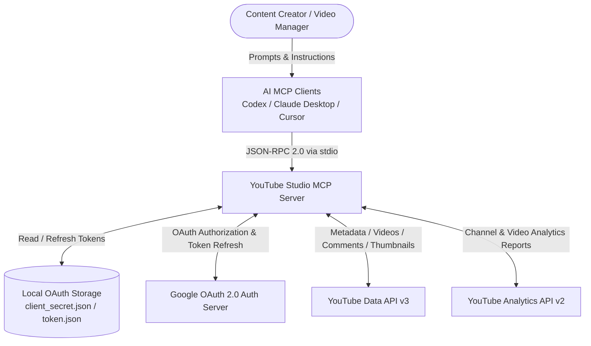

# Business Overview

## Business Context Diagram



### Text Alternative
```
User (Content Creator)
  --> AI MCP Client (Codex, Claude Desktop, Cursor)
    --> YouTube Studio MCP Server (Local stdio process)
      <--> Local Storage (secrets/client_secret.json, secrets/token.json)
      <--> Google OAuth 2.0 Service (Token verification & refresh)
      <--> YouTube Data API v3 (Channels, Videos, Playlists, Comments, Thumbnails)
      <--> YouTube Analytics API v2 (Channel & Video Performance Reports)
```

---

## Business Description
- **Business Description**: 
  YouTube Studio MCP is a local Model Context Protocol (MCP) server designed to empower content creators, channel managers, and AI assistants (such as OpenAI Codex, Anthropic Claude Desktop, Cursor IDE, etc.) with programmatic control over YouTube channel operations. It bridges natural language AI workflows with the YouTube Data API v3 and YouTube Analytics API v2 while preserving user privacy and security through local OAuth 2.0 Desktop app credentials.

- **Business Transactions**:
  1. **Authentication Management (`TX-AUTH`)**: Verify credentials presence, generate Google OAuth 2.0 authorization URL with PKCE, run local loopback callback server (`http://127.0.0.1:8765/oauth2callback`), and exchange authorization code for access & refresh tokens stored locally.
  2. **Channel Performance & Profile Inspection (`TX-CHAN-INSPECT`)**: Retrieve authenticated channel branding, snippet, related playlists (specifically uploads playlist), and aggregated public metrics (subscribers, views, video counts).
  3. **Video Catalog Management (`TX-VID-CATALOG`)**: List recently uploaded videos with pagination, retrieve detailed metadata (tags, categories, language, privacy status, statistics, content details) for specific video IDs.
  4. **Metadata & Privacy Optimization (`TX-VID-UPDATE`)**: Update video titles, descriptions, SEO tags, category mappings, default audio/text languages, and visibility states (public, private, unlisted).
  5. **Visual Asset Management (`TX-THUMB-UPLOAD`)**: Inspect local thumbnail image files (JPEG, PNG, etc.) and stream upload them directly as custom thumbnails for target YouTube videos.
  6. **Audience Engagement & Community Moderation (`TX-COMM-ENGAGE`)**: List top-level comment threads filtered by relevance or date, and publish new top-level comments on channel videos.
  7. **Analytics Auditing & Reporting (`TX-ANALYTICS-REPORT`)**: Extract channel-level aggregated metrics and daily time-series per-video performance metrics (views, watch time, retention percentages, engagement, subscriber gain/loss) across custom date ranges.

- **Business Dictionary**:
  - **MCP (Model Context Protocol)**: An open standard protocol allowing LLMs and AI agents to discover and invoke tools, query resources, and access external data via structured JSON-RPC messages.
  - **OAuth 2.0 PKCE (Proof Key for Code Exchange)**: A secure authorization flow designed for desktop/native applications without requiring hardcoded server-side client secrets.
  - **Channel Overview**: High-level metadata encompassing subscriber counts, total view counts, upload playlist IDs, and custom branding settings.
  - **Uploads Playlist**: A dedicated system playlist created automatically for every YouTube channel containing all uploaded videos.
  - **Video Metadata**: Descriptive data associated with a video including Title, Description, Tags, Category ID, Default Language, and Privacy Status (`public`, `unlisted`, `private`).
  - **Custom Thumbnail**: A high-resolution image uploaded by a creator to represent a video on YouTube watch and search pages.
  - **Channel Analytics**: Time-bounded aggregate metrics (views, estimatedMinutesWatched, averageViewDuration, averageViewPercentage, subscribersGained, subscribersLost, likes, comments, shares).
  - **Video Analytics**: Per-day breakdown of audience consumption and interaction metrics for an individual video asset.

---

## Component Level Business Descriptions

### `scripts/server.py` (Core MCP Runtime & YouTube API Bridge)
- **Purpose**: Runs as the persistent stdio JSON-RPC service serving tool requests from AI clients.
- **Responsibilities**:
  - Implements JSON-RPC 2.0 stdio protocol framing with `Content-Length` headers.
  - Exposes 11 registered MCP tools for AI discovery (`tools/list`) and execution (`tools/call`).
  - Encapsulates YouTube Data API v3 and YouTube Analytics API v2 endpoints.
  - Manages proactive OAuth token verification and automatic refresh on token expiry.
  - Validates tool input parameters and returns formatted JSON text content.

### `scripts/auth.py` (Local OAuth Provisioning Utility)
- **Purpose**: Handles one-time interactive OAuth 2.0 authorization with Google.
- **Responsibilities**:
  - Parses desktop client configuration from `secrets/client_secret.json`.
  - Generates PKCE verifiers, SHA-256 challenges, and cryptographic state tokens.
  - Launches local HTTP callback server on port `8765`.
  - Opens default web browser for user consent.
  - Exchanges authorization code for long-lived refresh token and initial access token, storing them securely in `secrets/token.json`.

### `secrets/` (Credential & Token Vault)
- **Purpose**: Local isolation for sensitive OAuth keys and session tokens.
- **Responsibilities**:
  - Ensures credentials stay strictly on the local machine and are excluded from git version control.
