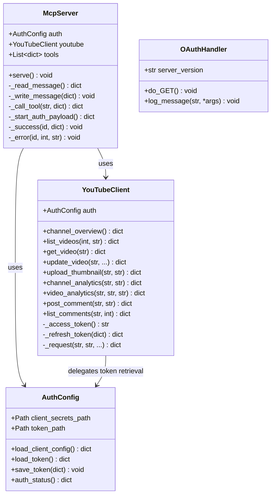

# Code Structure

## Build System
- **Type**: Standard Python Packaging (`pyproject.toml` based on PEP 621)
- **Configuration**:
  - Requires Python `>=3.10`
  - Linter: Ruff (`line-length = 100`)
  - Runtime Dependencies: None (Standard Library only)
  - Zero third-party packages required at runtime

---

## Key Classes and Module Structure



### Text Alternative
```
McpServer
  ├── AuthConfig (loads client secrets and tokens, monitors token validity)
  └── YouTubeClient (executes API queries, refreshes tokens via AuthConfig)

OAuthHandler (used by scripts/auth.py for PKCE OAuth callback listener)
```

---

## Existing Files Inventory

| File Path | Purpose / Responsibilities |
|---|---|
| `scripts/server.py` | Main entry point for the MCP stdio server. Implements JSON-RPC 2.0 protocol loop, MCP tool registry (11 tools), HTTP helpers, `AuthConfig`, `YouTubeClient`, and error formatting. |
| `scripts/auth.py` | Standalone CLI utility for interactive Google OAuth 2.0 PKCE authentication. Launches local loopback server (`:8765`), catches browser redirect, and writes `secrets/token.json`. |
| `scripts/publish_github.sh` | Shell script automation for publishing or synchronizing the repository with GitHub, setting metadata, and applying topic tags. |
| `pyproject.toml` | Python project metadata, author info, dependencies declaration, and Ruff linter configurations. |
| `.mcp.json` | MCP server configuration mapping `youtube-studio` command and environment variables for MCP clients. |
| `.codex-plugin/plugin.json` | Codex IDE plugin manifest describing user interface properties, prompts, and server integration. |
| `README.md` | Primary user-facing documentation, quickstart guide, tool summaries, and architectural rationale. |
| `docs/demo.md` | End-to-end setup and conversational demo walkthrough. |
| `docs/launch-copy.md` | Directory submissions and announcement copy templates. |
| `docs/mcp-client-config.md` | Configuration snippets for connecting various MCP clients (Claude Desktop, Cursor, Codex). |
| `docs/setup-google-oauth.md` | Step-by-step Google Cloud console setup instructions for creating desktop OAuth client IDs. |
| `docs/tools.md` | Detailed list and descriptions of all available MCP tools and example prompt invocations. |
| `CONTRIBUTING.md` | Guidelines for open-source contributions, pull requests, and coding standards. |
| `SECURITY.md` | Security disclosure guidelines, credential protection recommendations, and scope notes. |
| `LICENSE` | MIT License. |

---

## Design Patterns

### 1. Zero-Dependency Micro-Client Pattern
- **Location**: `scripts/server.py` and `scripts/auth.py`
- **Purpose**: Eliminates external dependency drift, package vulnerabilities, and installation friction for end users.
- **Implementation**: Utilizes Python's built-in `urllib.request`, `urllib.parse`, `http.server`, and `json` modules with robust error handling (`HTTPError`, `JSONDecodeError`).

### 2. Proactive Token Refresh Interceptor
- **Location**: `YouTubeClient._access_token()` in `scripts/server.py`
- **Purpose**: Prevents authentication failures during long-running agent sessions.
- **Implementation**: Checks `created_at + expires_in - 120 <= now()`. If the token is within 2 minutes of expiration, it automatically executes the refresh grant against Google OAuth and updates the local `token.json`.

### 3. Content-Length Header Stdio Protocol Framing
- **Location**: `McpServer._read_message()` and `McpServer._write_message()` in `scripts/server.py`
- **Purpose**: Complies with standard MCP JSON-RPC 2.0 communication over standard I/O streams.
- **Implementation**: Binary buffered reading of header metadata (`Content-Length`) followed by precise byte payload extraction and UTF-8 decoding.

---

## Critical Dependencies

### Runtime Dependencies
- **Python Standard Library (>=3.10)**:
  - `dataclasses`: Lightweight structured data containers (`AuthConfig`).
  - `urllib.request` / `urllib.parse` / `urllib.error`: Native HTTPS requests and query parameter encoding.
  - `http.server`: Minimal loopback callback server for OAuth.
  - `secrets` / `hashlib` / `base64`: Cryptographic random string generation and SHA-256 PKCE challenge generation.
  - `mimetypes`: Media type detection for thumbnail images.
  - `json`: JSON serialization/deserialization.

### Development & Tooling Dependencies
- **Ruff**: Fast Python linter configured with line length 100.
- **GitHub CLI (`gh`)**: Used optionally in `scripts/publish_github.sh` for repository management.
