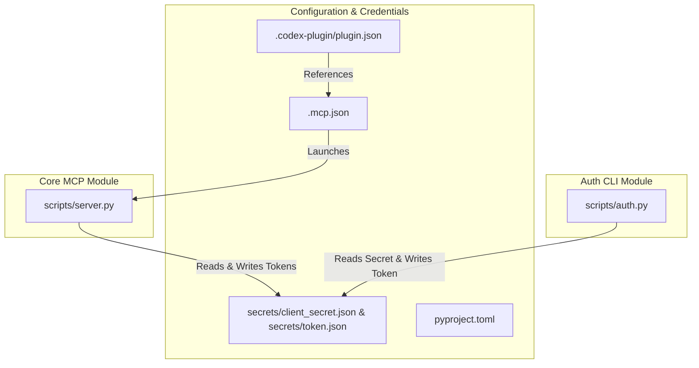

# Dependencies

## Internal Dependencies



### Text Alternative
```
scripts/server.py
  └── Reads/Writes secrets/client_secret.json & secrets/token.json

scripts/auth.py
  └── Reads secrets/client_secret.json & Writes secrets/token.json

.codex-plugin/plugin.json -> .mcp.json -> scripts/server.py
```

### Dependency Details
- **`scripts/server.py` depends on `secrets/`**:
  - **Type**: Runtime file dependency
  - **Reason**: Loads client credentials and saved OAuth tokens, writing refreshed tokens back to disk.
- **`scripts/auth.py` depends on `secrets/`**:
  - **Type**: Setup / CLI file dependency
  - **Reason**: Reads client ID/secret and saves new tokens upon completing OAuth consent.

---

## External Dependencies

### Runtime Dependencies
- **None (Zero Third-Party Packages)**:
  - The runtime depends exclusively on the Python standard library (CPython 3.10+).

### External Web & API Dependencies
| Service / API | Version | Purpose | Terms / Auth |
|---|---|---|---|
| **Google OAuth 2.0 Endpoint** | v2 | User authorization and token refresh | Google OAuth 2.0 Terms |
| **YouTube Data API** | v3 | Video metadata, comments, uploads playlist, thumbnail uploads | Google API Terms of Service |
| **YouTube Analytics API** | v2 | Channel and per-video metrics reporting | Google API Terms of Service |

### Development Dependencies
| Tool | Version | Purpose | License |
|---|---|---|---|
| **Ruff** | Latest | Code linting and formatting | MIT / Apache-2.0 |
| **GitHub CLI (`gh`)** | >= 2.0 | Automated repo publishing (`publish_github.sh`) | MIT |
